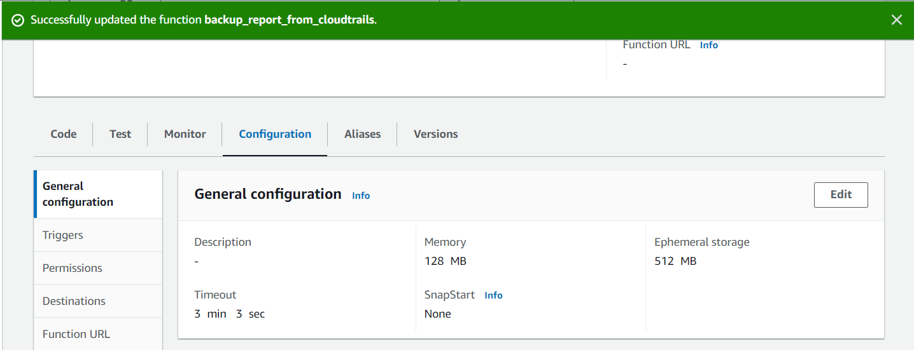
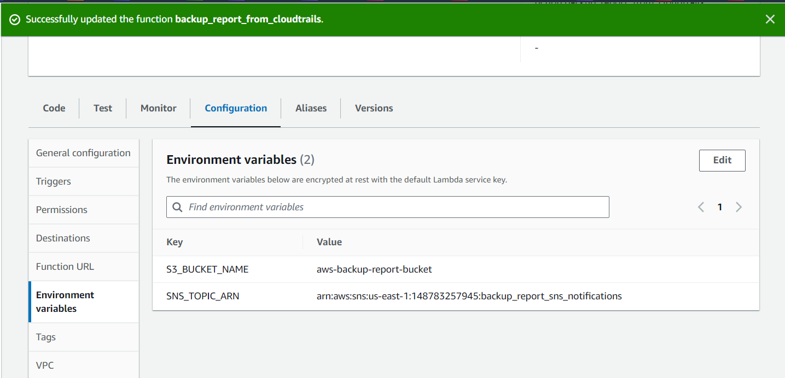
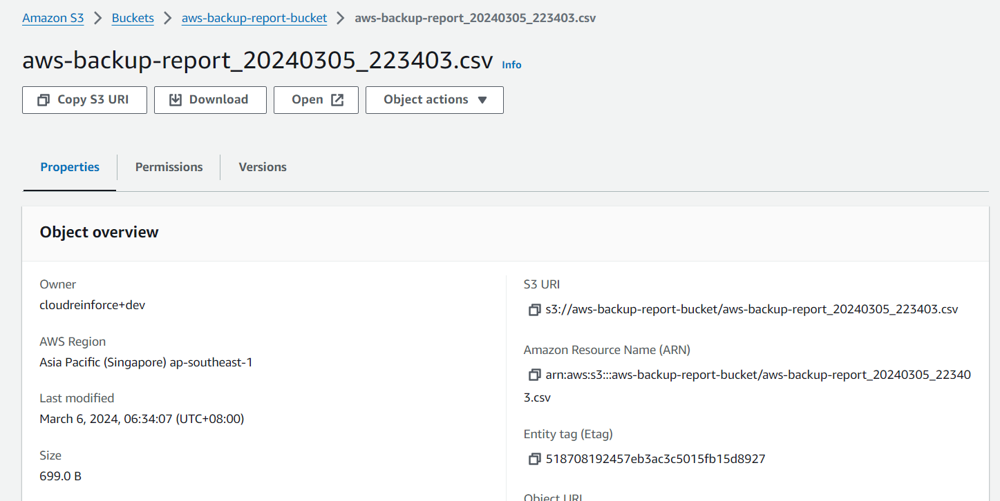
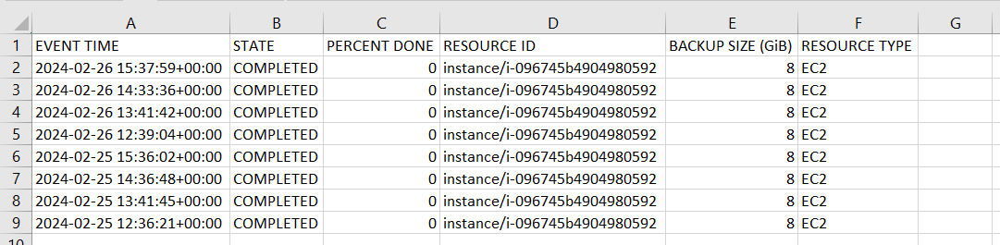

# aws-backup-report-from-cloudtrail-events
AWS Backup report generation from CloudTrail Events


## The below resources are being used in this solution:
1. Lambda function - Python 3.12 runtime. HandlerInfo - lambda_function.lambda_handler
2. SNS for Notification, create a subscription with email id
3. IAM Role with Lambda basic execution and Cloudtrail, SNS, S3 read and write permissions
4. KMS Key perrmissions required if S3/SNS resources are encrypted

# Deployment of the solution
Create a lambda function with the code given, and set the environment details for S3 bucket name and SNS Topic ARN.

Steps:
1. Lambda Function with Environments




2. Lambda function code.
```
import os
import boto3
import json
import csv
from datetime import datetime, timedelta

def bytes_to_gib(bytes_size):
    gib_size = bytes_size / (1024 ** 3)  # Convert bytes to gibibytes
    return round(gib_size, 2)

def get_resource_name(cloud_trail_event):
    try:
        request_parameters = cloud_trail_event.get('requestParameters', {})
        tags = request_parameters.get('tags', {})
        return tags.get('Name', '')
    except Exception as e:
        print(f"Error getting resource name: {e}")
        return ''

def lambda_handler(event, context):
    cloudtrail_client = boto3.client('cloudtrail')
    sns_client = boto3.client('sns')
    s3_client = boto3.client('s3')

    # Calculate default end time as the execution time
    end_time = datetime.utcnow()

    # Calculate start time as 30 days ago from the execution time
    start_time = end_time - timedelta(days=30)

    # Override with input event times if provided
    if 'startTime' in event:
        start_time = event['startTime']
    if 'endTime' in event:
        end_time = event['endTime']

    response = cloudtrail_client.lookup_events(
        LookupAttributes=[
            {'AttributeKey': 'EventName', 'AttributeValue': 'BackupJobCompleted'}
        ],
        StartTime=start_time,
        EndTime=end_time
    )

    events = response.get('Events', [])
    csv_data = [
        ['EVENT TIME', 'STATE', 'RESOURCE ID', 'RESOURCE NAME', 'BACKUP STATUS', 'BACKUP SIZE (GiB)', 'RESOURCE TYPE']
    ]

    for event in events:
        try:
            cloud_trail_event = json.loads(event.get('CloudTrailEvent', '{}'))
            service_event_details = cloud_trail_event.get('serviceEventDetails', {})
            
            event_time = event.get('EventTime', '')
            state = service_event_details.get('state', '')
            percent_done = service_event_details.get('percentDone', '')
            resource_arn = service_event_details.get('resourceArn', '')
            
            # Extracting resource ID from the ARN
            resource_id = resource_arn.split(':')[-1]
            backup_size_bytes = service_event_details.get('backupSizeInBytes', 0)
            backup_size_gib = bytes_to_gib(backup_size_bytes)
            resource_type = service_event_details.get('resourceType', '')
            
            # Get resource name and backup status (success or failure) from CloudTrail fields
            resource_name = get_resource_name(cloud_trail_event)
            backup_status = service_event_details.get('messageType', '')

            csv_data.append([event_time, state, resource_id, resource_name, backup_status, backup_size_gib, resource_type])
        except Exception as e:
            print(f"Error processing event: {e}")

    timestamp = datetime.utcnow().strftime('%Y%m%d_%H%M%S')
    csv_filename = f'/tmp/prj-env-month-report_{timestamp}.csv'

    with open(csv_filename, 'w', newline='') as csvfile:
        csv_writer = csv.writer(csvfile)
        csv_writer.writerows(csv_data)

    # Upload the CSV file to S3
    s3_bucket = os.environ['S3_BUCKET_NAME']
    s3_key = f'aws-backup-report_{timestamp}.csv'
    s3_object_location = f's3://{s3_bucket}/{s3_key}'
    s3_client.upload_file(csv_filename, s3_bucket, s3_key)

    # Send SNS notification with the generated CSV file as an attachment
    sns_topic_arn = os.environ['SNS_TOPIC_ARN']
    sns_subject = 'Backup Job Report'
    sns_message = f'Please find the attached CSV file for the backup job report.\nS3 Bucket: {s3_bucket}\nObject Location: {s3_object_location}'

    sns_client.publish(
        TopicArn=sns_topic_arn,
        Subject=sns_subject,
        Message=json.dumps({'default': sns_message}),
        MessageStructure='json',
        MessageAttributes={
            'Attachment': {
                'DataType': 'String',
                'StringValue': s3_object_location
            }
        }
    )

    return {
        'statusCode': 200,
        'body': json.dumps('CSV file generated and SNS notification sent successfully!')
    }


```

3. Backup reports in S3 bucket.


4. Report structure

